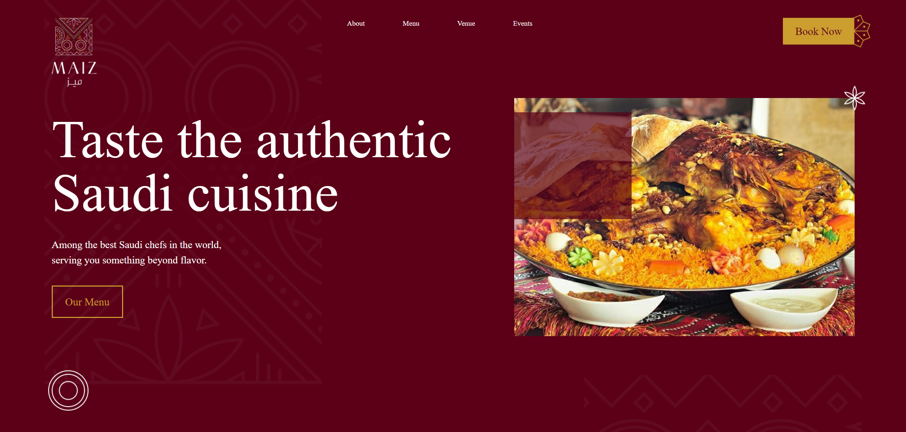

# Maiz Restaurant

This website showcases "Maiz," a modern and elegant restaurant, providing visitors with a comprehensive overview of the menu, ambiance, and offerings. It features a visually appealing design, using actual images from the restaurant to create an immersive experience.



## Features

- **Stunning Visuals:** The website uses high-quality images of the restaurant's interior, dishes, and overall ambiance to entice visitors.
- **Menu Display:** Showcases the full menu, including descriptions, prices, and images of the dishes.
- **Responsive Design:** Ensures the website is fully responsive and user-friendly across different devices and screen sizes.
- **Interactive Sections:** Includes interactive elements like hover effects and animations to enhance user engagement.
- **Contact and Location Information:** Provides easy access to the restaurant's contact details, location, and hours of operation.

## Technologies Used

- **React:** JavaScript library for building user interfaces.
- **Vite:** Fast build tool and development server.
- **Tailwind CSS:** Utility-first CSS framework for styling.
- **React Icons:** Provides a set of popular icons used in the UI.
- **ESLint:** Tool for identifying and fixing problems in JavaScript code.

## Installation

To run this project locally, follow these steps:

1. **Clone the Repository:**
   ```bash
   git clone https://github.com/ahmedkamal14/Maiz.git
   cd Maiz
   
2. **Install Dependencies:**
   ```bash
    npm install

3. **Run the Development Server:**
   ```bash
    npm run dev

  ## Deployment

  -This project is deployed on GitHub Pages. You can view the live site at: [Maiz](https://ahmedkamal14.github.io/Maiz/).
